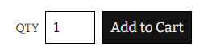
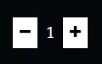
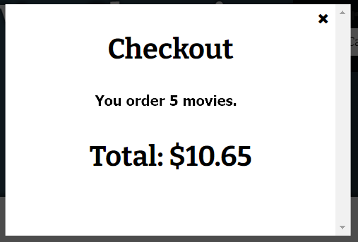

# 動態網頁設計 期末 Project

※ 請從以下的三個 project 中挑選其中一個 project 作為你的 final project.

※ 完成後,請將你的程式碼壓縮成 “姓名.zip” 並在規定的時間內上傳至數位學習平台

Project I – Memory Blocks Home Work 改寫為 Vue.js 的格式, 最高分 70 分

Project II – 延續 W13,14 周 Shuffle Cards 遊戲完成延伸的部分 最高分 85 分

Project III– 延續 W15.16 周 Movie Order 完成延伸的部分 最高分 110 分

---

## Project III – Movie Ordering

1. 延續 W15 & W16 的 Movie Ordering, 你可以瀏覽電影資訊並在點選/刪除你所需要的影片. 請在每一個電影資訊上新增數量,預設為 1, 使用者同時也可以自動增加數量加入購物車.如下圖（10%）

   

2. 請在購物車中讓使用者自動的調整購物數量（10%）

   

3. 請在購物車中讓使用者可以刪除所購物的項目（10%）
4. 請在購物車中新增兩個按鈕,分別是 Clear Cart 與 Check out

   - Clear Cart: 完全清空置物車內的所有內容（10%）
   - Checkout: 新增一個畫面（10%）顯示所有訂購的數量與目前的總金額（10%）

     

5. 提供查詢服務，讓使用者可以搜尋影片名稱的關鍵字，當查詢時出現該影片，如沒有符合條件，則可以採用對話框出現"無此影片"或你可以自行製作一個空白的圖片來呈現無此影片（20%）
6. 新增後台控制項, (可選擇是否要出現後台)並在後台中控制每一部影片的庫存數量(所以你必須在你的資料欄位中新增庫存數量的部分)，並在購物車上當使用者目前購買的數量已超過庫存時提醒使用者（30%）
